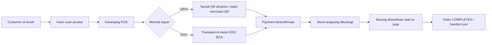
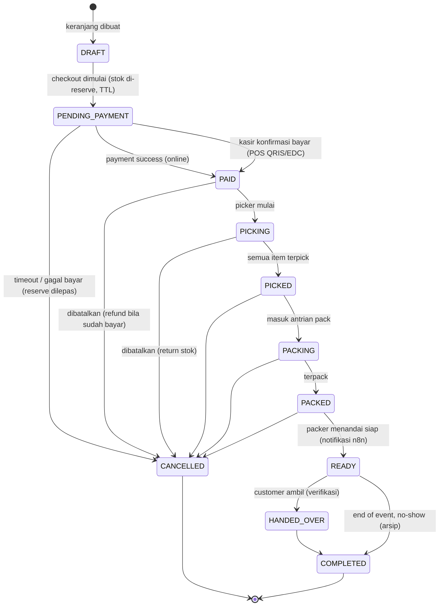
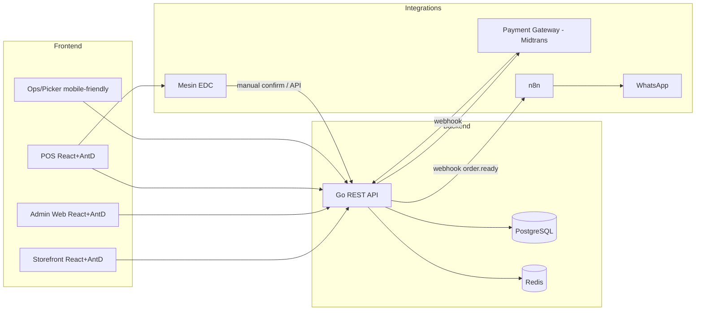

# PRD — Sistem POS & E-Commerce Hibrida untuk Event Bazaar

| | |
|---|---|
| **Nama Produk** | Bazaar POS & E-Commerce (Hibrida) |
| **Versi Dokumen** | 1.0 (Draft) |
| **Tanggal** | 2026-08-05 |
| **Status** | Draft — menunggu review & keputusan |

---

## 1. Ringkasan Eksekutif

Kami akan membangun **satu sistem terpadu** yang melayani dua jalur penjualan sekaligus:

1. **E-commerce** — pengunjung bisa belanja lewat website sebelum/datang di event, checkout, dan bayar via **QRIS**. Order masuk ke alur fulfillment (pick & pack), lalu pengunjung mengambil barang saat status sudah **ready** (diberitahu lewat **WhatsApp** via **n8n**).
2. **POS** — pengunjung yang datang langsung ke booth bisa membayar di kasir. Kasir scan produk, customer bayar via **QRIS** atau **EDC**. Barang langsung diserahkan.

Kedua jalur memakai **satu sumber stok yang sama** (PostgreSQL) sehingga tidak mungkin terjadi selisih stok. Semua transaksi tercatat dengan **ledger stok** yang bisa diaudit, dan order memiliki **state machine** yang jelas: `checkout → allocated → picked → packed → ready → handed over`.

Fitur tambahan yang dibahas di dokumen ini:

- **Link marketplace (Shopee) per SKU** — link di-regenerate menjadi **link affiliate**; tooltip "beli di Shopee / kirim ke rumah" di storefront.
- **Bundle** — produk bundling harga tetap; otomatis dipecah menjadi SKU komponen saat fulfillment (picker hanya ambil SKU tunggal).
- **Barcode ganda** — barcode PCS & barcode CARTON dengan setting qty per carton untuk mempercepat picking.
- **Portal fulfillment mobile-first** untuk picker & packer.
- **Nomor pickup** — QR code customer di-scan petugas → nomor paket yang ditempel saat packing agar mudah dicari.

Sistem dirancang **multi-event**: satu deployment dipakai berulang untuk beberapa event bazaar, masing-masing dengan katalog, harga, dan stok sendiri.

---

## 2. Latar Belakang & Masalah

- Event bazaar offline memiliki dua kanal penjualan yang sering berjalan terpisah: online (pre-order/catalog) dan offline (kasir di tempat).
- Jika stok tidak disinkronkan, sering terjadi **oversell** (barang terjual dua kali) atau **selisih stok** antara kanal online dan POS.
- Alur fulfillment manual (picker harus tahu order mana yang harus dipick, kapan sudah ready, kapan diambil customer) rawan salah dan tidak terdokumentasi.
- Pengunjung perlu tahu status order mereka secara real-time (kapan bisa diambil), sehingga perlu notifikasi otomatis.
- Produk bundling (paket hemat) perlu tampil sebagai satu item di toko, tetapi harus dipecah menjadi SKU tunggal saat diambil dari stok.
- Picking butuh percepatan: dukungan barcode per carton dan penomoran paket agar paket mudah ditemukan saat serah terima.
- Sebagian pengunjung lebih suka barang dikirim ke rumah — disediakan link ke marketplace (Shopee) sebagai jalur "beli & kirim".

---

## 3. Tujuan, Sasaran & Non-Tujuan

### 3.1 Tujuan (Goals)
1. Satu sumber kebenaran stok untuk kanal online & POS (tidak ada oversell / selisih stok).
2. Pengunjung bisa checkout online & bayar QRIS dengan pengalaman tanpa friksi.
3. Alur fulfillment yang jelas dan terukur: `allocated → picked → packed → ready → handed over`.
4. Notifikasi otomatis ke customer (WhatsApp) saat order siap diambil, terhubung via **n8n**.
5. POS yang cepat untuk kasir (scan → bayar QRIS/EDC → serah terima).
6. Mendukung **banyak event** dalam satu sistem.
7. Dukungan **bundle** yang otomatis dipecah menjadi SKU komponen saat fulfillment (picker hanya mempick SKU tunggal).
8. Setiap SKU bisa menautkan ke **marketplace (Shopee)** — pengunjung yang ingin kirim ke rumah membeli di sana.
9. Alur **penomoran paket (pickup number)** agar paket mudah ditemukan saat serah terima.

### 3.2 Sasaran Terukur (draft, akan dikonfirmasi)
- Waktu order online → **ready** (pick & pack) ≤ **15 menit** (SLA 90%).
- Tingkat oversell ≤ **0.05%** dari total order.
- Akurasi stok (stock count vs sistem) ≥ **99%** di akhir event.
- Waktu checkout online (klik bayar → QRIS tampil) ≤ **3 detik**.
- Transaksi POS (scan → selesai bayar) ≤ **30 detik** per pelanggan.

### 3.3 Non-Tujuan (Non-Goals)
- **Tidak ada pengiriman (delivery)** — semua order diambil di lokasi event (pickup only).
- **Bukan marketplace multi-vendor** — single merchant, semua produk milik satu entitas.
- **Bukan aplikasi mobile native** — cukup web (mobile-friendly) untuk tahap ini.
- Tidak mengelola akuntansi penuh (hanya laporan penjualan & stok).
- Tidak ada fitur loyalty program / membership di tahap pertama.
- **Tidak ada pembayaran tunai** — semua transaksi cashless (QRIS/EDC).
- **Belum mendukung varian produk (ukuran/warna)** — flat SKU; varian sebagai enhancement masa depan.

---

## 4. Asumsi & Batasan

- **Single merchant**: semua produk, stok, dan pendapatan milik satu penjual/entitas.
- **Skala menengah**: 100–1000 SKU, 100–500 order/hari puncak, konkurrensi rendah-sedang (amannya dirancang untuk ribuan order/hari).
- **Pickup only**: customer mengambil barang di lokasi bazaar.
- **Multi-event**: tiap event punya katalog, harga, dan stok terpisah; riwayat event diarsipkan.
- **Koneksi internet tersedia** di lokasi event (opsional: mode tahan-gangguan untuk POS dibahas di Risiko).
- Staf teknis tersedia untuk setup n8n & integrasi WhatsApp.
- Akun merchant payment gateway (Midtrans/Xendit/DOKU) sudah/siap didaftarkan sebelum go-live.
- **Marketplace: Shopee saja.** Link produk yang diinput admin akan **di-regenerate menjadi link affiliate** (Shopee Affiliate Program) sehingga pembelian via link memberi komisi ke admin.
- **Printer label: thermal label 10×10 cm** untuk label nomor pickup.
- **Semua pembayaran cashless** (QRIS & EDC) — tanpa tunai.
- **EDC: BCA** dipakai sebagai terminal fisik mandiri; konfirmasi pembayaran secara manual oleh kasir di POS (tanpa integrasi API).
- **Varian produk: flat SKU** untuk tahap awal (tiap item = 1 SKU); varian ukuran/warna ditunda sebagai enhancement.

---

## 5. Pengguna & Persona

| Peran | Deskripsi | Kanal utama |
|---|---|---|
| **Pengunjung / Customer** | Belanja online & ambil barang di event | Website (storefront) |
| **Admin / Super Admin** | Kelola produk, event, stok, harga, laporan, konfigurasi | Admin Web |
| **Kasir (POS)** | Scan produk & proses pembayaran di booth | POS Web (layar sentuh/keyboard) |
| **Picker** | Menerima daftar order, mengambil barang dari stok | Aplikasi/Web Ops (mobile-friendly) |
| **Packer** | Memeriksa & mengemas order, menandai ready | Aplikasi/Web Ops |
| **Operator Handover** | Menyerahkan barang ke customer saat diambil (verifikasi) | Aplikasi/Web Ops (mobile-friendly) |
| **Manajer Event** | Membuat event, mengatur katalog & stok per event, memantau SLA | Admin Web |

---

## 6. Alur Bisnis (Business Flows)

### 6.1 Alur Online (E-commerce)

```mermaid
flowchart LR
    A[Pengunjung buka website] --> B[Browse & pilih produk]
    B --> B1{Punya link marketplace?}
    B1 -->|Ya - mau kirim ke rumah| B2[Tooltip "Beli di Shopee" → buka marketplace]
    B1 -->|Ambil di event| C[Keranjang]
    C --> D[Checkout: isi nama + no WA]
    D --> E[Pilih QRIS - tampil QR dinamis]
    E -->|scan & bayar| F[Payment Gateway webhook]
    F -->|sukses| G[Order PAID / stock allocated]
    G --> H[Picker: bundle sudah dipecah jadi SKU tunggal]
    H --> I[Picked - scan barcode pcs / carton]
    I --> J[Packed - dapat nomor pickup #001, #002...]
    J --> K[Label nomor pickup ditempel di paket]
    K --> L[READY]
    L -->|webhook n8n| M[WA customer: barang siap diambil + QR code]
    L --> N[Customer datang & scan QR code]
    N --> O[Petugas lihat nomor pickup → cari paket]
    O --> P[Handover - serah terima]
    P --> Q[Order COMPLETED]
```

### 6.2 Alur POS (Offline)



> **Cashless**: semua transaksi POS hanya **QRIS** atau **EDC** — tidak ada tunai.
>
> **POS mendukung**: scan barcode PCS **atau** barcode CARTON (langsung jual qty per carton), dan penjualan bundle (otomatis dipecah menjadi komponen saat transaksi; stok komponen yang berkurang).

### 6.3 Alur Pembayaran & Konfirmasi

- **QRIS online (dynamic QR)**: backend minta QR ke payment provider dengan nominal, customer scan, provider kirim webhook `payment.paid`, backend tandai order `PAID` dan **alokasikan stok**.
- **QRIS di POS**: gunakan dynamic QR dari provider dengan nominal transaksi, konfirmasi otomatis via webhook, atau **static merchant QR** dengan konfirmasi manual kasir (fallback).
- **EDC**: transaksi diproses di **mesin EDC fisik (BCA)** secara mandiri — kasir input nominal, customer bayar, mesin approve. Setelah itu **kasir menandai "sudah bayar" di POS** (konfirmasi manual). Tidak perlu integrasi API EDC; model ini bekerja dengan EDC merek/bank apa pun.

---

## 7. Persyaratan Fungsional (Prioritas MoSCoW)

> **Legenda prioritas**: `M`=Must, `S`=Should, `C`=Could, `W`=Won't (tahap ini)

### 7.1 Manajemen Master Data & Event

| ID | Kebutuhan | Prioritas |
|---|---|---|
| MD-1 | CRUD produk (nama, SKU, kategori, deskripsi, unit) | M |
| MD-2 | **Upload gambar produk** (multiple, tampil di storefront) — via portal admin | M |
| MD-3 | CRUD varian produk (ukuran/warna) — **ditunda** (flat SKU untuk tahap awal) | W |
| MD-4 | CRUD event bazaar (nama, tanggal, lokasi, jam operasional) | M |
| MD-5 | Kelola katalog & **harga per event** (harga bisa beda antar event) | M |
| MD-6 | Kelola **stok per event** (jumlah awal, penambahan, penyesuaian) | M |
| MD-7 | Status produk: active / inactive / sold out (per event) | M |
| MD-8 | **Link marketplace (Shopee)** per SKU (opsional) — admin input link produk Shopee | M |
| MD-12 | **Konversi ke link affiliate (Shopee Affiliate)**: saat link Shopee disimpan, sistem mengubahnya menjadi link affiliate (regenerate dengan kode affiliate); link inilah yang dipakai storefront | M |
| MD-9 | **Barcode ganda per SKU**: barcode PCS dan barcode CARTON, plus setting **qty per carton** | M |
| MD-10 | **Manajemen bundle**: buat bundle, pilih komponen & qty-nya, **harga tetap manual**, barcode & gambar bundle sendiri | M |
| MD-11 | **Available stock** selalu dibaca langsung dari database (satu sumber, shared online & POS) — bukan cache terpisah | M |

### 7.2 Storefront (E-commerce)

| ID | Kebutuhan | Prioritas |
|---|---|---|
| SF-1 | Halaman daftar produk (grid), filter kategori & pencarian | M |
| SF-2 | Halaman detail produk (gambar, harga, sisa stok tampil) | M |
| SF-3 | Keranjang belanja (persisten, mobile-friendly) | M |
| SF-4 | Checkout: isi **nama + nomor WhatsApp** (untuk notifikasi) | M |
| SF-5 | Pilih metode bayar QRIS → tampil QR dinamis | M |
| SF-6 | Halaman status order untuk pengunjung (link/QR) | M |
| SF-7 | **Tooltip "Beli di Shopee / kirim ke rumah"** di setiap SKU yang punya link marketplace; klik → buka **link affiliate Shopee** (tab baru, memberi komisi ke admin) | M |
| SF-8 | Bundle tampil sebagai produk (harga tetap, gambar); stok bundle **derived dari komponen** (bisa dibeli jika semua komponen tersedia) | M |
| SF-9 | Auto-refresh stok real-time dari database | S |
| SF-10 | Indikasi "hampir habis" / "sold out" (termasuk bundle yang salah satu komponennya habis) | S |
| SF-11 | **Halaman detail SKU**: galeri gambar (multi), deskripsi, stok, pilih qty, tambah keranjang, link Shopee affiliate | M |
| SF-12 | **Saran beli bersama / saran checkout bersama**: produk lain (kategori sama didahulukan) di halaman detail & keranjang | S |

### 7.3 Checkout & Pembayaran

| ID | Kebutuhan | Prioritas |
|---|---|---|
| PY-1 | Integrasi payment gateway (QRIS dynamic) | M |
| PY-2 | **Reservasi stok** saat checkout dimulai (TTL ~15 menit), dilepas jika gagal bayar | M |
| PY-3 | Webhook pembayaran idempotent (aman dari duplikat) | M |
| PY-4 | Timeout & auto-cancel jika pembayaran tidak selesai | M |
| PY-5 | Tampilan status pembayaran: menunggu / sukses / gagal / kedaluwarsa | M |
| PY-6 | Simpan bukti pembayaran & referensi transaksi provider | M |
| PY-7 | Refund (manual oleh admin) bila order dibatalkan setelah bayar | S |

### 7.4 Manajemen Order

| ID | Kebutuhan | Prioritas |
|---|---|---|
| OR-1 | Daftar order (online & POS) dengan filter status, event, waktu | M |
| OR-2 | Detail order (item, harga, customer, riwayat status & timestamp) | M |
| OR-3 | Pembatalan order (alasan wajib) + pelepasan reservasi stok | M |
| OR-4 | Audit trail setiap perubahan status | M |
| OR-5 | Pencarian order by no. order / nama / no. WA | M |

### 7.5 Fulfillment (Pick & Pack)

| ID | Kebutuhan | Prioritas |
|---|---|---|
| FP-1 | Antrian order untuk picker (urutan FIFO / by priority) | M |
| FP-2 | Picker menandai `picked` (per item atau per order) | M |
| FP-3 | **Bundle di-explode otomatis menjadi baris SKU komponen** saat masuk antrian pick — picker hanya mempick SKU tunggal (bukan bundle) | M |
| FP-4 | Dukungan **barcode carton**: scan barcode carton → menandai qty_per_carton sekaligus (picking lebih cepat) | M |
| FP-5 | Antrian pack, packer menandai `packed` | M |
| FP-6 | **Penomoran pickup saat packing**: sistem memberi nomor berurutan per event (#001, #002, ...) → cetak label **thermal 10×10 cm** → ditempel di paket | M |
| FP-7 | Packer menandai `ready` → memicu notifikasi | M |
| FP-8 | **Portal fulfillment mobile-first (mobile-approach)**: dioptimalkan untuk HP/tablet picker & packer (tombol besar, input & scan barcode) | M |
| FP-9 | **Batch picking** (beberapa order sekaligus) untuk efisiensi | C |
| FP-10 | Label/QR order untuk scan di tiap tahap | S |
| FP-11 | SLA timer: durasi order → ready, tampil di dashboard | S |

### 7.6 POS

| ID | Kebutuhan | Prioritas |
|---|---|---|
| PS-1 | Keranjang POS cepat: scan SKU/barcode, tambah qty, hapus | M |
| PS-2 | Tampilkan harga, subtotal, dan **sisa stok** produk saat scan | M |
| PS-3 | Pembayaran: **QRIS** (dynamic/static) dan **EDC** | M |
| PS-4 | **Semua transaksi cashless** — hanya QRIS & EDC (tidak ada tunai) | M |
| PS-5 | Cetak/struk digital (opsional, thermal printer) | C |
| PS-6 | **Scan barcode carton = jual per carton** (tambah qty_per_carton sekaligus ke keranjang POS) | M |
| PS-7 | **Jual bundle di POS**: bundle di-explode menjadi komponen saat transaksi (stok komponen yang berkurang) | M |
| PS-8 | POS tidak boleh menjual item yang stoknya habis (cek real-time dari database) | M |
| PS-9 | POS order langsung `handed over` (serah terima saat itu juga) | M |
| PS-10 | Mode offline/tahan-gangguan untuk POS (antrian sinkron ulang) | S |

### 7.7 Manajemen Stok

| ID | Kebutuhan | Prioritas |
|---|---|---|
| ST-1 | **Ledger stok** (stock movement) untuk setiap perubahan: `IN`, `RESERVE`, `UNRESERVE`, `PICK`, `RETURN`, `ADJUST`, `SOLD` | M |
| ST-2 | Satu sumber stok untuk online & POS (transaksi DB atomik) | M |
| ST-3 | Real-time availability: `available = total - reserved - sold` | M |
| ST-4 | Pengamanan oversell: **row-level lock / conditional update** saat alokasi | M |
| ST-5 | **Available stock dibaca langsung dari database** — online & POS memakai fungsi alokasi yang sama, tanpa sinkronisasi terpisah | M |
| ST-6 | **Availability bundle derived dari komponen**: bundle bisa dibeli jika semua komponen cukup; penjualan bundle mengurangi stok komponen | M |
| ST-7 | Penjualan per **carton**: mengurangi stok sebanyak qty_per_carton | M |
| ST-8 | Stok opname (adjust) dengan alasan & otorisasi | S |
| ST-9 | Riwayat & rekonsiliasi stok per event | S |

### 7.8 Notifikasi (n8n + WhatsApp)

| ID | Kebutuhan | Prioritas |
|---|---|---|
| NT-1 | Backend kirim **webhook ke n8n** saat order `ready` | M |
| NT-2 | n8n kirim **WhatsApp** ke customer: "order siap diambil, datang ke booth X" | M |
| NT-3 | Notifikasi tambahan (opsional): pembayaran sukses, reminder ambil | C |
| NT-4 | Log notifikasi (status terkirim / gagal / retry) | M |
| NT-5 | Fallback: jika WA gagal, staff bisa hubungi manual (data no. WA tersimpan) | M |
| NT-6 | Pengaturan pesan template (editable oleh admin) | S |

### 7.9 Handover / Pengambilan

| ID | Kebutuhan | Prioritas |
|---|---|---|
| HV-1 | Customer mendapat **QR code order** setelah pembayaran sukses (ditampilkan di halaman status order & via link) | M |
| HV-2 | Saat datang, petugas **scan QR customer** → sistem menampilkan order + **nomor pickup** paketnya | M |
| HV-3 | Petugas mencari paket berdasarkan **nomor pickup** (label sudah ditempel saat packing) → verifikasi identitas (nama/no. WA) | M |
| HV-4 | Tandai `handed over` → `completed` | M |
| HV-5 | Aturan no-show: order `ready` tidak diambil hingga akhir event → penanganan (diarsipkan / di-refund) | S |

### 7.10 Admin, Laporan & Monitoring

| ID | Kebutuhan | Prioritas |
|---|---|---|
| RP-1 | Dashboard ringkas: penjualan hari ini, order aktif, SLA fulfillment | M |
| RP-2 | Laporan penjualan (per event, per hari, per produk) | M |
| RP-3 | Laporan stok & selisih (akhir event) | S |
| RP-4 | Laporan metode pembayaran (QRIS vs EDC) | S |
| RP-5 | Manajemen pengguna & peran (RBAC) | M |
| RP-6 | Audit log aksi admin/kasir | S |

---

## 8. State Machine Order



**Catatan:**
- **POS**: `PAID → HANDED_OVER → COMPLETED` terjadi hampir seketika (tanpa pick/pack) karena barang diserahkan langsung. Alur pick/pack hanya untuk order **online**.
- Saat transisi `PACKED`, sistem **memberi nomor pickup berurutan per event** dan mencetak label untuk ditempel di paket.
- **Bundle** hanya ada di level keranjang/order; saat masuk fulfillment otomatis di-explode menjadi baris komponen SKU tunggal (picker & stok bekerja di level komponen).
- Setiap transisi wajib mencatat `timestamp` + `actor` (audit trail).
- Setiap transisi yang melepaskan stok (cancel/return) memicu ledger `UNRESERVE`/`RETURN` atomik.

---

## 9. Manajemen Stok & Pengamanan Oversell

**Pendekatan: Ledger + Reservasi atomik**

- Setiap perubahan stok dicatat di tabel `stock_movements` (ledger). Tidak pernah ada update angka stok langsung tanpa jejak.
- Saat checkout online dimulai → status `PENDING_PAYMENT` → sistem melakukan `RESERVE` (memindahkan dari *available* ke *reserved*) di dalam **satu transaksi DB** dengan `SELECT ... FOR UPDATE` atau `UPDATE ... WHERE available >= qty`. Jika `available` tidak cukup → ditolak / pesan stok habis.
- Saat pembayaran sukses → reserve tetap terkunci (menjadi milik order). Saat `picked` → `RESERVE` dikonversi ke `SOLD`/`PICK`.
- Saat order dibatalkan (belum diambil) → `UNRESERVE` (stok kembali available).
- POS & online memakai **fungsi alokasi yang sama** di backend, sehingga tidak mungkin race condition antar kanal.
- **Bundle**: availability dihitung dari komponen (`min(available komponen ÷ qty kebutuhan)`); saat alokasi, setiap komponen di-reserve sesuai qty bundle; di fulfillment baris bundle dipecah menjadi komponen.
- **Carton**: setiap SKU punya `barcode_carton` + `qty_per_carton`; penjualan/picking per carton mengurangi stok sebanyak `qty_per_carton` sekaligus.

**Contoh perhitungan availability:**
```
available  = total_stock - reserved - sold
reserved   = jumlah qty pada order PENDING_PAYMENT / PAID / (belum picked)
sold       = jumlah qty yang sudah picked/ready/handed over
```

**Struktur data stok (ringkas):**

| Entitas | Fungsi |
|---|---|
| `event_products` | stok total & harga per produk per event |
| `stock_movements` | ledger semua mutasi (audit & rekonsiliasi) |
| `order_items` | qty terikat ke order (sumber reserved/sold) |
| `Redis lock (opsional)` | lapis pengaman tambahan untuk operasi alokasi berkecepatan tinggi |

---

## 10. Rekomendasi Payment Provider

### 10.1 Kebutuhan
- QRIS **dynamic** (nominal ditentukan sistem) untuk online checkout & POS.
- Webhook konfirmasi pembayaran yang andal & idempotent.
- Dukungan **EDC** (untuk kanal POS) — via integrasi API atau konfirmasi manual.
- Sandbox/test environment untuk development.
- Kemudahan onboarding & fee kompetitif.

### 10.2 Perbandingan

| Kriteria | **Midtrans** | **Xendit** | **DOKU** |
|---|---|---|---|
| QRIS dynamic | ✅ | ✅ | ✅ |
| Kualitas dokumentasi | ⭐⭐⭐⭐⭐ | ⭐⭐⭐⭐ | ⭐⭐⭐ |
| Webhook & idempotency | Sangat baik | Sangat baik | Baik |
| Ekosistem & komunitas | Terbesar | Besar | Menengah |
| Fokus kanal offline/EDC | Menengah | Menengah | Tinggi |
| Onboarding | Mudah | Sedang | Sedang |
| Keandalan (uptime) | Tinggi | Tinggi | Tinggi |

### 10.3 Rekomendasi

> **Pilihan utama: Midtrans (Snap API)** — dokumentasi paling matang, dukungan QRIS dynamic, webhook andal, komunitas besar, dan mudah diintegrasi dari Go backend.

- **Online checkout & POS QRIS** → Midtrans Snap (QRIS dynamic), konfirmasi otomatis via webhook.
- **EDC (POS) = BCA, model konfirmasi manual**: EDC dipakai sebagai terminal fisik mandiri; kasir menandai "sudah bayar" di POS setelah mesin approve. Tidak perlu integrasi API EDC (kecuali nanti butuh otomasi penuh, baru evaluasi DOKU/M2P).
- **Cadangan**: Xendit sebagai alternatif jika onboarding Midtrans terkendala.

**Keputusan (sudah ditentukan)**: Midtrans sebagai pilihan utama; EDC = **BCA** dengan konfirmasi manual kasir di POS.

---

## 11. Arsitektur Teknis

### 11.1 Stack Teknologi (Rekomendasi)

| Layer | Teknologi | Catatan |
|---|---|---|
| Database | **PostgreSQL** | Sumber kebenaran tunggal; transaksi atomik untuk stok |
| Backend | **Go** | REST API; framework: **Chi** atau **Echo** + **pgx**; clean architecture |
| Cache/Session/Lock | **Redis** | Keranjang, rate limit, distributed lock stok (opsional lapis kedua) |
| Frontend — Admin & POS | **React + TypeScript + Ant Design** | Komponen tabel/form/modal matang untuk backoffice & POS |
| Frontend — Storefront | **React + TypeScript + Ant Design** | Mobile-friendly; bisa dipisah menjadi app terpisah dengan shared UI |
| Otomasi Notifikasi | **n8n** (self-hosted) | Workflow: webhook `order.ready` → kirim WhatsApp |
| WhatsApp | WhatsApp Cloud API / Baileys (via n8n) | Konfirmasi provider WA sebelum go-live |
| Payment | **Midtrans** (Snap) | QRIS dynamic + webhook |
| Deployment | Docker + Docker Compose (awal) / VPS | CI/CD sederhana (GitHub Actions) |
| Observability | Prometheus + Grafana (opsional), structured logging | — |

> **Alasan pilih Ant Design (React):** kebutuhan utama adalah UI yang padat data (tabel order, form produk, dashboard) dan interaksi POS yang cepat. Ant Design memiliki ekosistem komponen paling matang untuk jenis ini, dokumentasi lengkap, dan bekerja sangat baik dengan TypeScript. Storefront & admin bisa memakai komponen yang sama (shared library) sehingga hemat waktu. Alternatif: Vue + Naive UI jika tim lebih nyaman dengan Vue.

### 11.2 Diagram Arsitektur



### 11.3 Data Model (ERD)

```mermaid
erDiagram
    USERS ||--o{ ORDERS : places
    USERS ||--o{ USER_ROLES : has
    ROLES ||--o{ USER_ROLES : assigned_to
    PRODUCTS ||--o{ BUNDLE_COMPONENTS : "bundle berisi komponen"
    PRODUCTS ||--o{ BUNDLE_COMPONENTS : "komponen dari bundle"
    EVENTS ||--o{ EVENT_PRODUCTS : has
    PRODUCTS ||--o{ EVENT_PRODUCTS : priced_in
    EVENT_PRODUCTS ||--o{ ORDER_ITEMS : sold_as
    ORDERS ||--o{ ORDER_ITEMS : contains
    ORDERS ||--o{ PAYMENTS : has
    ORDERS ||--o{ STOCK_MOVEMENTS : triggers
    EVENT_PRODUCTS ||--o{ STOCK_MOVEMENTS : has_movements
    ORDERS ||--o{ ORDER_STATUS_HISTORY : has
    ORDERS ||--o{ NOTIFICATION_LOGS : sends_to
    ORDERS ||--o{ PICK_LISTS : included_in
    PICK_LISTS ||--o{ PICK_LIST_ITEMS : has
    ORDER_ITEMS ||--o{ PICK_LIST_ITEMS : picked_as

    USERS { bigint id PK }
    PRODUCTS { bigint id PK, string sku, string name, string category, string barcode_pcs, string barcode_carton, int qty_per_carton, string marketplace_link, boolean is_bundle }
    BUNDLE_COMPONENTS { bigint id PK, bigint bundle_id FK, bigint component_id FK, int component_qty }
    EVENTS { bigint id PK, string name, date start_at, date end_at }
    EVENT_PRODUCTS { bigint id PK, int stock_total, int price, int available }
    ORDERS { bigint id PK, string order_no, enum channel, enum status, string customer_name, string customer_phone, string qr_code, string pickup_no }
    ORDER_ITEMS { bigint id PK, enum item_type, int qty, int price, enum state }
    PAYMENTS { bigint id PK, enum method, string provider_ref, enum status }
    STOCK_MOVEMENTS { bigint id PK, enum type, int qty, string reason }
    ORDER_STATUS_HISTORY { bigint id PK, enum status, timestamp at, bigint actor }
    NOTIFICATION_LOGS { bigint id PK, enum channel, enum status, string payload }
    PICK_LISTS { bigint id PK, enum status }
    PICK_LIST_ITEMS { bigint id PK, int qty, enum status }
```

### 11.4 API & Webhook Utama

**API (REST, JSON):**
- `POST /api/v1/events/{id}/products` — katalog per event
- `POST /api/v1/products` / `PATCH /api/v1/products/{id}` — termasuk barcode pcs/carton, qty per carton, link marketplace
- `POST /api/v1/affiliate/convert` — ubah link Shopee → link affiliate (dengan kode affiliate)
- `POST /api/v1/products/{id}/images` — upload gambar produk
- `POST /api/v1/bundles` dan `POST /api/v1/bundles/{id}/components` — manajemen bundle & komponen
- `POST /api/v1/carts/{id}/items`, `POST /api/v1/checkout`
- `POST /api/v1/payments` — buat pembayaran QRIS (ke Midtrans)
- `POST /api/v1/webhooks/payment` — dari Midtrans (idempotent, verifikasi signature)
- `POST /api/v1/orders/{id}/pick`, `.../pack`, `.../ready`, `.../handover` — transisi status
- `POST /api/v1/orders/{id}/assign-pickup-no` — beri nomor pickup & cetak label (saat packed)
- `POST /api/v1/orders/scan` — scan QR customer → tampilkan order + nomor pickup (handover)
- `POST /api/v1/orders/{id}/cancel`
- `POST /api/v1/webhooks/n8n/notify` — pemicu internal ke n8n (order.ready)
- `GET /api/v1/orders/{no}` — cek status oleh pengunjung
- POS: `POST /api/v1/pos/orders` (checkout+payment sekaligus), `POST /api/v1/pos/payments/confirm`

**Webhook keluar (back-end → n8n):**
- `order.ready` — kirim WA "order siap diambil"
- (opsional) `payment.success`, `order.reminder`

### 11.5 Keamanan
- **Auth**: JWT + RBAC (admin, kasir, picker, packer, operator, pengunjung via link).
- **Verifikasi webhook**: validasi signature payment provider (Midtrans `signature_key`) & shared secret n8n.
- **Idempotency**: semua webhook & payment diproses idempotent (cek `provider_ref` unik).
- **Rate limiting** pada endpoint publik (Redis).
- **Input validation** ketat; parameterized query (pgx) untuk cegah SQL injection.
- **Logging & audit**: semua aksi stok & status order tercatat.
- Data pribadi customer (nama, no. WA) hanya untuk keperluan order & notifikasi (patuhi UU PDP).

---

## 12. Persyaratan Non-Fungsional

| Aspek | Kebutuhan |
|---|---|
| **Performa** | API p95 < 300 ms; checkout < 3 dtk; POS scan feedback < 1 dtk; sanggup 500+ order/hari, puncak 50–100 concurrent checkout |
| **Ketersediaan** | Uptime target 99.5% selama jam event; payment webhook diproses dengan retry & DLQ |
| **Konsistensi stok** | Alokasi stok atomik; tidak boleh oversell antar kanal (verifikasi dengan uji beban) |
| **Keandalan** | Webhook idempotent; queue/retry untuk notifikasi WA; backup PostgreSQL otomatis (PITR) |
| **Keamanan** | Enkripsi data at-rest & in-transit (TLS); RBAC; audit log |
| **Skalabilitas** | Arsitektur siap untuk event lebih besar (horisontal scaling API; DB tetap satu master awal) |
| **Maintainability** | Clean architecture Go; migrasi DB (golang-migrate); CI/CD; dokumentasi API (OpenAPI) |
| **Usability** | Storefront mobile-friendly; **portal fulfillment mobile-first** (dipakai di HP/tablet picker & packer — tombol besar, input & scan barcode); POS dengan keyboard/barcode scanner |

---

## 13. KPI / Metrik Keberhasilan

| KPI | Target |
|---|---|
| Waktu order → ready (SLA) | ≤ 15 menit untuk 90% order online |
| Tingkat oversell | ≤ 0.05% |
| Akurasi stok akhir event | ≥ 99% |
| Tingkat pembayaran sukses (QRIS) | ≥ 95% dari attempt |
| Konversi checkout → paid | ≥ 60% |
| Abandoned payment (timeout) | ≤ 25% |
| Transaksi POS per jam di jam sibuk | ≥ 60 transaksi |
| Waktu cari paket saat handover (via nomor pickup) | ≤ 30 detik |
| Akurasi picking bundle (komponen lengkap & benar) | ≥ 99% |
| Notifikasi WA terkirim | ≥ 99% (dengan retry) |

---

## 14. Roadmap & Milestone

| Fase | Lingkup | Estimasi (draft) |
|---|---|---|
| **M1 — Fondasi** | Setup repo (Go+PostgreSQL+React+AntD), auth & RBAC, master data (produk, upload gambar, barcode pcs/carton + qty per carton, link marketplace, event, katalog, stok), bundle & komponen, ledger stok | 2–3 minggu |
| **M2 — Storefront & Pembayaran** | Katalog publik, keranjang, checkout, integrasi Midtrans sandbox (QRIS), reservasi stok TTL, webhook payment | 2–3 minggu |
| **M3 — Fulfillment & Notifikasi** | State machine order, portal fulfillment mobile-first (antrian pick/pack/ready), explode bundle → SKU komponen, scan carton, penomoran pickup + cetak label, handover scan QR, integrasi n8n → WhatsApp | 2–3 minggu |
| **M4 — POS** | Modul POS (scan, keranjang, QRIS/EDC — cashless), sinkron stok real-time, struk (opsional) | 2–3 minggu |
| **M5 — Laporan & Go-Live** | Dashboard, laporan, uji beban stok, UAT, seeding data event, go-live & dukungan | 2 minggu |

> Estimasi perlu disesuaikan dengan kapasitas tim.

---

## 15. Risiko & Mitigasi

| Risiko | Dampak | Mitigasi |
|---|---|---|
| **Oversell antar kanal** (online vs POS) | Kehilangan kepercayaan, komplain | Ledger + alokasi atomik (SELECT FOR UPDATE), uji beban, Redis lock opsional |
| **Selisih stok karena barang rusak/hilang** | Stok tidak akurat | Proses opname & `ADJUST` dengan otorisasi; rekonsiliasi harian |
| **Webhook payment gagal/terlambat** | Order stuck di PENDING_PAYMENT | Retry + polling status ke Midtrans; dashboard untuk pengecekan manual |
| **Koneksi internet buruk di lokasi** | POS & handover terhambat | POS mode offline (antrian lokal + sinkron); fallback manual; siapkan internet cadangan (4G/hotspot) |
| **EDC BCA: transaksi gagal / selisih nominal** | Payment tidak tercatat benar | Kasir wajib verifikasi struk EDC sebelum konfirmasi di POS; cek nominal; rekonsiliasi harian |
| **No-show (order ready tidak diambil)** | Stok terikat sampai akhir event | Aturan cutoff & arsip end-of-event; reminder WA; kebijakan refund |
| **WhatsApp rate limit / blokir** | Notifikasi gagal | Template resmi WhatsApp Business; retry & antrian; fallback panggilan manual |
| **Bundle: komponen tidak lengkap** | Order tidak bisa dipenuhi | Validasi availability semua komponen saat checkout; explode & verifikasi saat picking |
| **Label nomor pickup salah / tidak terbaca** | Paket susah ditemukan | Label besar + QR; cetak ulang; lookup alternatif via nama/no. WA |
| **Qty per carton salah setting** | Selisih stok & kesalahan picking | Qty per carton divalidasi saat input; rekonsiliasi & opname |
| **Link affiliate Shopee kedaluwarsa / kode salah** | Komisi hilang / link rusak | Simpan link asli + link affiliate; validasi & cek berkala; fallback ke link asli jika gagal |
| **Data customer (WA) bocor** | Pelanggaran PDP | Minimalkan data, enkripsi, akses terbatas, log audit |
| **Tim tidak familiar Go** | Lambatnya development | Struktur bersih, dokumentasi, mulai dari M1 yang kecil |

---

## 16. Pertanyaan Terbuka / Keputusan yang Perlu Diambil

1. ~~Metode pembayaran POS~~ **Sudah diputuskan: semua cashless** — QRIS + EDC, tanpa tunai.
2. ~~Varian produk~~ **Sudah diputuskan: flat SKU** untuk tahap awal; varian ukuran/warna sebagai enhancement di masa depan.
3. ~~Marketplace~~ **Sudah diputuskan: Shopee saja** + link di-regenerate menjadi link affiliate (Shopee Affiliate Program).
4. **Payment provider**: setuju **Midtrans** sebagai pilihan utama? (Atau mau dicoba juga Xendit/DOKU di sandbox?)
5. ~~EDC~~ **Sudah diputuskan: EDC BCA** sebagai terminal fisik mandiri; konfirmasi manual kasir di POS (tanpa integrasi API).
6. **WhatsApp**: pakai **WhatsApp Business API** (resmi, template) atau solusi lain?
7. **Struktur tim**: siapa yang handle backend (Go), frontend, dan n8n?
8. **Kebutuhan printer struk** di POS untuk tahap awal?
9. ~~Printer label~~ **Sudah diputuskan: thermal label 10×10 cm** untuk nomor pickup.
10. **Durasi & SLA**: SLA 15 menit pick→ready realistis untuk tim fulfillment yang ada?

---

*Dokumen ini akan diperbarui setelah keputusan di atas diambil.*
